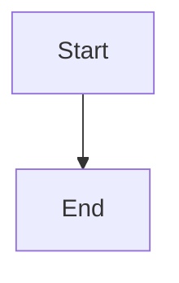

# CIS Documentation Structure

> **Version**: 1.1.5
> **Last Updated**: 2026-02-18

This document describes the organization of CIS documentation and helps contributors find information quickly.

---

## 📁 Root Documentation

| File | Purpose | Audience |
|------|---------|----------|
| [README.md](../README.md) | Project overview and quick start | All users |
| [SECURITY.md](../SECURITY.md) | Security policy and vulnerability reporting | All users |
| [LICENSE](../LICENSE) | MIT License | All users |
| [CHANGELOG.md](../CHANGELOG.md) | Version history and changes | All users |
| [CONTRIBUTING.md](../CONTRIBUTING.md) | Contribution guidelines | Developers |

---

## 📚 Plan Documents (`docs/plan/`)

### Version-Specific Plans

```
docs/plan/
├── v1.1.7/              # Current version plans
│   ├── claude/           # Claude AI analysis
│   │   ├── CIS_COMPREHENSIVE_REVIEW_REPORT.md
│   │   ├── CONSOLIDATED_ISSUES_LIST.md
│   │   ├── AGENT_COMPARISON_ANALYSIS.md
│   │   └── COMPLETION_REPORT.md
│   ├── kimi/             # Kimi AI analysis
│   │   ├── CIS_Code_Quality_Review_Report.md
│   │   ├── CIS_Architecture_Review_Report.md
│   │   ├── CIS_Security_Audit_Report.md
│   │   └── CIS_Performance_Review_Report.md
│   └── glm/              # GLM AI analysis
│       └── (review reports)
├── v1.1.6/              # Previous version (archived)
└── v1.1.5/              # Previous version (archived)
```

**Purpose**: Version-specific planning, analysis reports, and implementation tracking

**Key Documents**:
- `CONSOLIDATED_ISSUES_LIST.md`: All identified issues (P0/P1/P2)
- `COMPLETION_REPORT.md`: Progress tracking and completion status

---

## 📖 Getting Started (`docs/getting-started/`)

### Quick Start Guides

```
docs/getting-started/
├── quickstart.md         # Quick start guide (5 min setup)
├── installation.md       # Installation instructions
├── first-agent.md        # Creating your first agent
├── basic-usage.md        # Basic usage examples
└── troubleshooting.md   # Common issues and solutions
```

**Status**: 🚧 To be created

---

## 🏗️ Architecture (`docs/architecture/`)

### Design Documents

```
docs/architecture/
├── overview.md           # System architecture overview
├── memory.md             # Memory system design
│   └── MEMORY_DOMAIN_EXPLAINED.md
├── network.md            # Networking and P2P
│   └── PATH_BASED_MEMORY_ISOLATION.md
├── scheduler/            # DAG scheduler
│   └── DISTRIBUTED_DAG_COORDINATOR.md
├── agent/                # Agent system
│   └── AGENT_CONFIGURATION_GUIDE.md
└── security/             # Security design
    └── AGENT_TEAMS_MEMORY_ISOLATION.md
```

**Purpose**: In-depth technical design and architecture documentation

**Key Documents**:
- `memory/MEMORY_DOMAIN_EXPLAINED.md`: Private vs Public memory
- `agent/AGENT_CONFIGURATION_GUIDE.md`: Agent setup guide
- `scheduler/DISTRIBUTED_DAG_COORDINATOR.md`: DAG orchestration

---

## 🔧 Development Guides (`docs/development/`)

### Developer Documentation

```
docs/development/
├── building.md           # How to build from source
├── testing.md            # Testing strategy and guidelines
├── debugging.md          # Debugging tips and tools
├── profiling.md          # Performance profiling
└── contributing/         # Contribution guidelines
    ├── workflow.md       # Development workflow
    ├── pull-requests.md  # PR guidelines
    └── code-style.md     # Code style guide
```

**Status**: 🚧 To be created

---

## 📖 User Guides (`docs/guides/`)

### User Documentation

```
docs/guides/
├── agents/               # Agent usage
│   ├── creating-agents.md
│   ├── configuring-skills.md
│   └── persistent-agents.md
├── memory/               # Memory management
│   ├── private-vs-public.md
│   ├── encryption.md
│   └── search.md
├── skills/               # Skill development
│   ├── creating-skills.md
│   ├── skill-lifecycle.md
│   └── skill-reference.md
├── networking/           # Network and P2P
│   ├── setup-p2p.md
│   ├── acl-configuration.md
│   └── federation.md
└── advanced/             # Advanced topics
    ├── performance-tuning.md
    ├── security-hardening.md
    └── deployment.md
```

**Status**: 🚧 To be created

---

## 📋 Reference (`docs/reference/`)

### API Reference

```
docs/reference/
├── cli.md                # CLI command reference
├── configuration.md       # Configuration options
├── api/                  # API documentation
│   ├── memory-api.md
│   ├── agent-api.md
│   └── skill-api.md
└── skills/               # Skill reference
    └── builtin-skills.md
```

**Status**: 🚧 To be created

---

## 🗂️ Archive (`docs/archive/`)

### Historical Documents

```
docs/archive/
├── releases/            # Historical release notes
│   ├── v1.1.5/
│   ├── v1.1.4/
│   └── v1.1.3/
└── plans/                # Old implementation plans
    ├── v1.1.2/
    └── v1.1.1/
```

**Purpose**: Historical reference and archival

---

## 🔍 Issue Tracking (`docs/plan/`)

### Consolidated Issues List

**Location**: `docs/plan/v1.1.7/claude/CONSOLIDATED_ISSUES_LIST.md`

**Structure**:
```markdown
## P0: Critical Security Issues
- P0-1: Issue description
- P0-2: Issue description
...

## P1: High Priority Issues
- P1-1: Issue description
- P1-2: Issue description
...

## P2: Technical Debt
- P2-1: Issue description
- P2-2: Issue description
...
```

**Status Tracking**:
- ✅ Complete: Fixed and verified
- 🚧 In Progress: Currently being worked on
- ⏳ Planned: Scheduled for future work
- 📅 Backlog: Not yet scheduled

---

## 📊 Progress Reports

### Completion Reports

**Location**: `docs/plan/v1.1.7/claude/COMPLETION_REPORT.md`

**Content**:
- Executive summary
- Detailed fix descriptions
- Performance metrics
- Remaining work
- Recommendations

### Audit Reports

**Claude AI**: `docs/plan/v1.1.7/claude/CIS_COMPREHENSIVE_REVIEW_REPORT.md`
**Kimi AI**: `docs/plan/v1.1.7/kimi/CIS_*_Review_Report.md`
**GLM AI**: `docs/plan/v1.1.7/glm/*_Review_Report.docx`

---

## 🎯 Quick Navigation

### For Users

- **New to CIS?** → Start with [README.md](../README.md)
- **Quick Setup** → See getting-started guides
- **Need Help?** → Check troubleshooting guide
- **Security Question?** → Review [SECURITY.md](../SECURITY.md)

### For Developers

- **Architecture?** → See `docs/architecture/`
- **Contributing?** → See `docs/development/contributing/`
- **API Docs?** → See `docs/reference/api/`
- **Issues?** → Check `docs/plan/v1.1.7/claude/CONSOLIDATED_ISSUES_LIST.md`

### For Contributors

- **Style Guide?** → See `docs/development/contributing/code-style.md`
- **PR Workflow?** → See `docs/development/contributing/pull-requests.md`
- **Testing?** → See `docs/development/testing.md`

---

## 📝 Documentation Guidelines

### Writing Style

1. **Clarity**: Use simple, clear language
2. **Structure**: Use headings, lists, and code blocks
3. **Examples**: Provide concrete examples
4. **Links**: Cross-reference related documents
5. **Versioning**: Keep docs in sync with code

### Markdown Conventions

```markdown
# Heading 1 (Document title)

## Heading 2 (Major section)

### Heading 3 (Subsection)

- Bullet point
- Another bullet point

1. Numbered list
2. Another item

**Bold text** for emphasis
*Italic text* for secondary emphasis

`Inline code` for code terms

```rust
// Code block with syntax highlighting
fn example() {
    println!("Hello");
}
```
```

### Diagram Format

Use ASCII art or Mermaid diagrams:

```text
┌─────────┐
│ System  │
└─────────┘
```



---

## 🔄 Documentation Maintenance

### Update Frequency

- **Root docs**: Monthly review
- **Plan docs**: As needed (per version)
- **API docs**: With every release
- **Guides**: When features change

### Versioning

Documentation versions track code versions:
- `v1.1.5` docs → `v1.1.5` code
- Major version changes require doc restructure

### Review Process

1. Author creates/updates documentation
2. Technical review for accuracy
3. User review for clarity
4. Merge into main branch

---

## 📞 Documentation Support

### Questions?

- **General questions**: Open GitHub issue
- **Doc bugs**: Fix directly or open issue
- **Suggestions**: Open issue with `docs` label

### Contributing

See [CONTRIBUTING.md](../CONTRIBUTING.md) for contribution guidelines.

---

**Last Updated**: 2026-02-18
**Doc Structure Version**: 1.1.5
**Maintainer**: CIS Team
