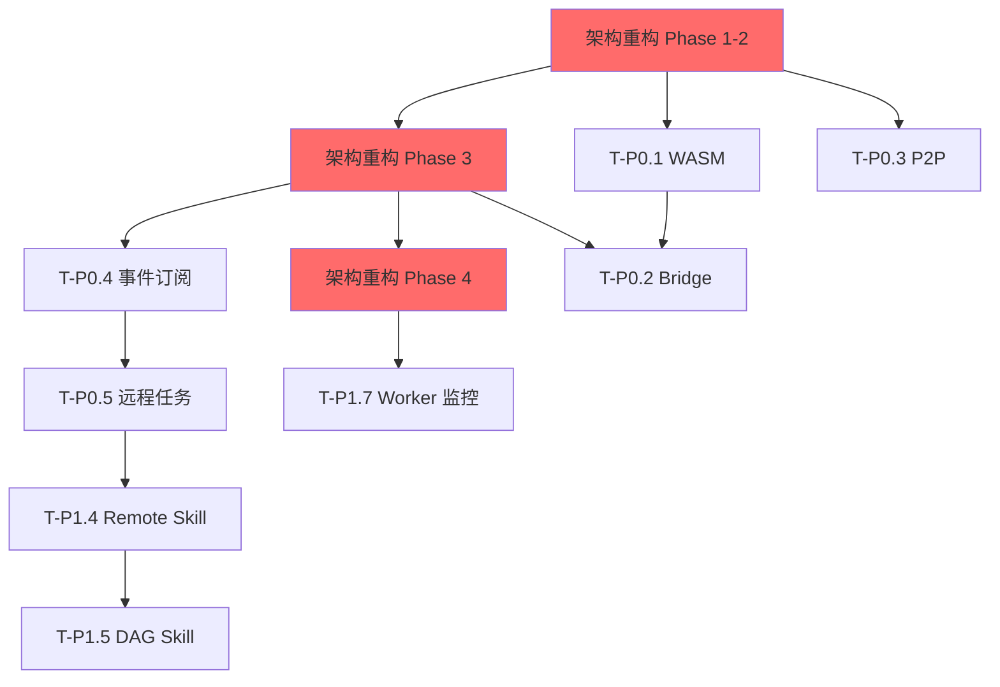

# CIS v1.1.4 版本计划评审报告

> 评审日期: 2026-02-10
> 评审人: Claude (AI Assistant)
> 评审范围: v1.1.4 版本计划全套文档
> 文档版本: v1.0.0

---

## 执行摘要

### 评审结论

| 维度 | 评分 | 说明 |
|------|------|------|
| 计划完整性 | ⭐⭐⭐⭐☆ (4/5) | 覆盖核心功能，但缺少部分关键规划 |
| 可执行性 | ⭐⭐⭐☆☆ (3/5) | 任务分解清晰，但依赖关系复杂 |
| 风险控制 | ⭐⭐⭐☆☆ (3/5) | 基础风险评估完整，深度不足 |
| 架构健康 | ⭐⭐☆☆☆ (2/5) | 架构问题识别准确，但重构计划与开发计划割裂 |
| **总体** | **3.0/5** | **需要补充关键规划** |

### 关键发现

#### 优点
1. **问题识别全面** - 70+ 处简化实现分析详尽
2. **架构洞察深刻** - 准确识别耦合问题和单例模式弊端
3. **任务分解细致** - 工作量估算到天级，可追踪
4. **优先级清晰** - P0/P1/P2 分级合理

#### 严重缺失 (需立即补充)
1. **🔴 测试策略缺失** - 无具体测试计划和验收用例
2. **🔴 重构与开发割裂** - 架构重构计划独立于功能开发，冲突风险高
3. **🔴 安全性空白** - 无安全评估和加固计划
4. **🟡 发布流程缺失** - 无回滚计划和灰度策略
5. **🟡 性能基准模糊** - 验收标准缺乏基线数据

---

## 一、文档完整性评审

### 1.1 现有文档清单

```
v1.1.4/
├── README.md                          ✅ 完整
├── ROADMAP.md                         ✅ 完整
├── TASK_BREAKDOWN.md                  ✅ 完整
├── SIMPLIFIED_IMPLEMENTATION_ANALYSIS.md  ✅ 完整
├── ARCHITECTURE_REVIEW.md             ✅ 完整
├── ARCHITECTURE_QUICK_REF.md          ✅ 完整
├── PORT_CONSOLIDATION_PROPOSAL.md     ✅ 完整
└── REVIEW_CLAUDE.md                   📝 本文件
```

### 1.2 缺失文档 (需补充)

| 文档 | 优先级 | 说明 |
|------|--------|------|
| **TESTING_STRATEGY.md** | 🔴 P0 | 测试策略、用例设计、覆盖率目标 |
| **SECURITY_ASSESSMENT.md** | 🔴 P0 | 安全威胁模型、加固措施 |
| **RELEASE_PLAN.md** | 🟡 P1 | 发布流程、回滚计划、版本兼容 |
| **PERFORMANCE_BASELINE.md** | 🟡 P1 | 性能基线、压测计划 |
| **RISK_MITIGATION.md** | 🟡 P1 | 深度风险分析和应对预案 |
| **DESIGN_WASM_EXECUTION.md** | 🟢 P2 | WASM 执行设计 (已标记待创建) |
| **DESIGN_P2P_PROTOCOL.md** | 🟢 P2 | P2P 协议设计 (已标记待创建) |
| **DESIGN_FEDERATION_PROTOCOL.md** | 🟢 P2 | 联邦协议设计 (已标记待创建) |
| **QUALITY_GATE.md** | 🟡 P1 | 质量门禁、代码审查标准 |
| **MONITORING_PLAN.md** | 🟢 P2 | 监控指标、告警规则 |

---

## 二、计划合理性评审

### 2.1 时间线合理性

#### 现有计划
```
Week 1-2:  WASM 执行修复 (5d)
Week 2-3:  P2P 网络完善 (5d)
Week 3-4:  Agent 联邦 (4d)
Week 4-5:  调度器完善 (3d)
Week 5-6:  CLI 优化 (3d)

总计: 20d 工作量 (单人) / 10d (双人并行)
实际计划: 4-6 周
```

#### 问题分析

| 问题 | 风险 | 建议 |
|------|------|------|
| **工期估算过于乐观** | 高 | WASM 运行时集成复杂度被低估，建议增加 50% 缓冲 |
| **并行开发冲突** | 中 | Phase 1-2 有依赖但时间重叠，需明确串行部分 |
| **架构重构时间缺失** | 高 | 8周重构计划未计入 4-6周开发周期 |
| **测试时间未预留** | 高 | 每个阶段未预留测试和 Bug 修复时间 |

#### 建议调整

```
Week 1-2:  架构重构 Phase 1-2 (配置 + 全局状态) + WASM 基础
Week 3-4:  架构重构 Phase 3 (事件总线) + P2P 核心
Week 5-6:  架构重构 Phase 4 (大文件拆分) + Agent 联邦
Week 7-8:  调度器完善 + 端口合并
Week 9-10: CLI 优化 + 全面测试
Week 11-12: 安全加固 + 性能优化 + 发布准备

调整后: 12 周 (3 个月)
```

### 2.2 任务依赖关系

#### 现有依赖图
```
T-P0.1 (WASM) ──┬── T-P0.2 (Bridge)
                 │
T-P0.3 (P2P) ────┤
                 │
T-P0.4 (订阅) ───┴── T-P0.5 (远程任务)
```

#### 问题识别

1. **隐式依赖未标注**:
   - T-P1.4 (Remote Skill) 依赖 T-P0.5 (远程任务)，但未标注
   - T-P1.5 (DAG Skill) 依赖 T-P1.4 (Remote Skill)，但未标注
   - T-P1.7 (Worker 监控) 依赖架构重构完成，否则数据无法获取

2. **重构依赖缺失**:
   - 全局状态消除应优先于所有 P2P 任务
   - 事件总线应优先于 Matrix Bridge 调用

#### 建议补充



---

## 三、关键缺失规划

### 3.1 测试策略 (🔴 P0)

#### 当前状态

- ROADMAP 中提到"代码测试覆盖率提升至 75%+"
- TASK_BREAKDOWN 中每个任务有"测试用例补充"子任务
- **但无具体测试策略**

#### 缺失内容

##### A. 测试金字塔设计

```
                  ┌─────────────┐
                  │   E2E 测试   │  10% (关键路径)
                  │   (5-10个)  │
                  ├─────────────┤
                  │  集成测试   │  30% (模块间)
                  │  (50-100个) │
                  ├─────────────┤
                  │  单元测试   │  60% (函数级)
                  │ (300-500个) │
                  └─────────────┘
```

##### B. 测试覆盖率基线

| 模块 | 当前覆盖率 | 目标覆盖率 | 优先级 |
|------|-----------|-----------|--------|
| `p2p/` | ?% | 80% | P0 |
| `wasm/` | ?% | 85% | P0 |
| `agent/federation/` | ?% | 80% | P0 |
| `scheduler/` | ?% | 75% | P1 |
| `matrix/` | ?% | 70% | P1 |
| `skill/` | ?% | 75% | P1 |

##### C. 关键测试场景

**P0 - 必须覆盖**:
1. WASM Skill 生命周期 (加载 → 执行 → 清理)
2. P2P 连接建立 → 数据传输 → 断线重连
3. Agent 联邦任务分发 → 执行 → 结果返回
4. 调度器 DAG 依赖解析 → 递归执行

**P1 - 重要场景**:
1. 并发任务调度
2. 网络分区恢复
3. 内存泄漏检测
4. 性能压测

##### D. 测试工具栈

```toml
[dev-dependencies]
# 单元测试
tokio-test = "0.4"
mockall = "0.12"  # Mock 框架

# 集成测试
proptest = "1.0"  # 属性测试
quickcheck = "1.0"

# E2E 测试
criterion = "0.5"  # 性能测试

# 覆盖率
tarpaulin = "0.27"  # Rust 覆盖率工具
cargo-llvm-cov = "0.5"
```

#### 建议行动

创建 [TESTING_STRATEGY.md](./TESTING_STRATEGY.md)，包含：
1. 测试金字塔设计
2. 覆盖率基线测量
3. 关键场景测试用例
4. Mock/Stub 设计规范
5. CI/CD 集成方案

---

### 3.2 安全性评估 (🔴 P0)

#### 当前状态

- **完全缺失安全性规划**
- 代码中存在多处安全隐患
- 无威胁模型和安全基线

#### 发现的安全问题

| 问题 | 位置 | 风险等级 |
|------|------|---------|
| 未验证的输入 | `matrix/server.rs` | 高 |
| 明文传输 | `p2p/transport.rs` | 高 |
| 缺少认证 | `federation/` | 高 |
| SQL 注入风险 | `storage/db.rs` | 中 |
| 硬编码密钥 | 多处配置 | 中 |

#### 缺失的安全规划

##### A. 威胁模型

```
┌─────────────────────────────────────────────────────────────┐
│                        CIS 威胁模型                          │
├─────────────────────────────────────────────────────────────┤
│                                                             │
│  外部威胁:                                                   │
│    • 网络嗅探 (P2P/Matrix 明文传输)                          │
│    • 中间人攻击 (缺少 TLS)                                   │
│    • DDoS (P2P 节点)                                        │
│    • 恶意 WASM 模块 (沙箱逃逸)                               │
│                                                             │
│  内部威胁:                                                   │
│    • 提权漏洞 (Agent 执行命令)                               │
│    • 数据泄露 (公私域记忆未隔离)                             │
│    • 资源耗尽 (无限递归 DAG)                                 │
│                                                             │
└─────────────────────────────────────────────────────────────┘
```

##### B. 安全加固清单

**P0 - 阻塞发布**:
1. [ ] P2P 传输启用 TLS (noise protocol)
2. [ ] Matrix 联邦签名验证
3. [ ] WASM 沙箱资源限制
4. [ ] Agent 命令白名单

**P1 - 重要加固**:
1. [ ] 输入验证框架
2. [ ] 速率限制
3. [ ] 审计日志
4. [ ] 密钥管理 (KDF)

##### C. 安全测试计划

```bash
# 依赖扫描
cargo audit

# 静态分析
cargo clippy -- -W clippy::all
cargo fmt --check

# 模糊测试
cargo fuzz

# 渗透测试
# (需专业团队执行)
```

#### 建议行动

创建 [SECURITY_ASSESSMENT.md](./SECURITY_ASSESSMENT.md)，包含：
1. 威胁模型分析
2. 安全加固路线图
3. 安全测试计划
4. 漏洞响应流程

---

### 3.3 发布计划 (🟡 P1)

#### 当前状态

- ROADMAP 中有验收标准
- **但无发布流程、回滚计划、版本兼容策略**

#### 缺失内容

##### A. 发布流程

```
┌─────────────────────────────────────────────────────────────┐
│                      v1.1.4 发布流程                         │
├─────────────────────────────────────────────────────────────┤
│                                                             │
│  Phase 1: Pre-Release (Week 10)                             │
│    • 功能冻结                                               │
│    • 全面回归测试                                           │
│    • 性能压测                                               │
│    • 安全审计                                               │
│                                                             │
│  Phase 2: Release Candidate (Week 11)                       │
│    • RC1 标记                                              │
│    • 内部试运行                                             │
│    • Bug 修复                                               │
│                                                             │
│  Phase 3: GA Release (Week 12)                              │
│    • 正式发布                                               │
│    • 文档更新                                               │
│    • 社区通知                                               │
│                                                             │
│  Phase 4: Post-Release (Week 13-14)                         │
│    • 监控告警                                               │
│    • 热修复准备                                             │
│                                                             │
└─────────────────────────────────────────────────────────────┘
```

##### B. 回滚计划

| 触发条件 | 回滚步骤 | 负责人 |
|---------|---------|--------|
| 核心功能不可用 | 1. 停止新版本部署<br>2. 切换到 v1.1.3<br>3. 数据迁移回滚 | TBD |
| 严重安全漏洞 | 1. 紧急补丁<br>2. 强制更新<br>3. CVE 公告 | TBD |
| 性能严重退化 | 1. 配置降级<br>2. 功能开关关闭<br>3. 性能分析 | TBD |

##### C. 版本兼容策略

**向后兼容**:
```rust
// Matrix 协议版本
pub const MATRIX_PROTOCOL_VERSION: &str = "v1.1";

// Federation 兼容性
#[derive(Serialize, Deserialize)]
pub struct FederationMessage {
    pub version: String,  // "1.1.3", "1.1.4"
    pub payload: FederationPayload,
}

// 版本协商
impl FederationMessage {
    pub fn is_compatible(&self, other: &str) -> bool {
        // 允许 minor 版本差异
        semver::Version::parse(&self.version)
            .map(|v| v.major == 1 && v.minor <= 2)
            .unwrap_or(false)
    }
}
```

**数据迁移**:
```sql
-- 数据库迁移脚本
-- migrations/v1_1_4_to_v1_1_5.sql
ALTER TABLE agents ADD COLUMN capabilities TEXT;
ALTER TABLE skills ADD COLUMN wasm_hash TEXT;

-- 迁移工具
// cis-core/src/migrations/v1_1_4.rs
pub async fn migrate_to_v1_1_5(db: &Db) -> Result<()> {
    // ...
}
```

#### 建议行动

创建 [RELEASE_PLAN.md](./RELEASE_PLAN.md)，包含：
1. 发布流程图
2. 回滚预案
3. 版本兼容策略
4. 数据迁移方案

---

### 3.4 性能基准 (🟡 P1)

#### 当前状态

ROADMAP 中有性能验收标准：
- WASM 启动时间 < 100ms
- P2P 连接建立 < 5s
- 联邦任务分发 < 1s

**但无基线数据、压测计划、优化目标**

#### 缺失内容

##### A. 性能基线

| 指标 | 当前 (v1.1.3) | 目标 (v1.1.4) | 测量方法 |
|------|--------------|--------------|---------|
| WASM 启动 | ? ms | < 100ms | Criterion |
| P2P 连接 | ? ms | < 5000ms | 集成测试 |
| 任务分发 | ? ms | < 1000ms | 压测 |
| 内存占用 | ? MB | < 500MB | heaptrack |
| CPU 使用率 | ? % | < 50% | perf |

##### B. 压测计划

```bash
# P2P 并发连接
cargo test --test p2p_stress -- --nocapture

# 联邦任务压测
# 模拟 100 个节点，1000 TPS
python benchmarks/federation_stress.py

# WASM 并发执行
cargo bench --bench wasm_execution
```

##### C. 性能优化路线

**P0 - 阻塞优化**:
1. WASM 预编译缓存
2. P2P 连接池
3. 数据库查询优化

**P1 - 重要优化**:
1. 内存池化
2. 零拷贝传输
3. 延迟加载

#### 建议行动

创建 [PERFORMANCE_BASELINE.md](./PERFORMANCE_BASELINE.md)，包含：
1. v1.1.3 性能基线测量
2. 压测脚本和工具
3. 性能优化路线图
4. 监控指标定义

---

### 3.5 风险缓解 (🟡 P1)

#### 当前状态

ROADMAP 中有基础风险评估：
- WASM 运行时复杂性
- P2P NAT 穿透难度
- Matrix 协议变更
- 资源不足

**但无深度分析和应对预案**

#### 缺失内容

##### A. 深度风险分析

| 风险 | 概率 | 影响 | 当前措施 | 缺失措施 |
|------|------|------|---------|---------|
| WASM 沙箱逃逸 | 低 | 极高 | 无 | 沙箱安全审计 |
| libp2p 升级破坏 | 中 | 高 | 锁定版本 | 升级测试策略 |
| 并发竞争 | 中 | 高 | 无 | 并发测试 |
| 内存泄漏 | 中 | 高 | 无 | 内存测试 |
| 依赖库漏洞 | 高 | 中 | 无 | 定期审计 |

##### B. 应急预案

**场景 1: WASM 运行时延迟**
```yaml
trigger: WASM 集成超过 2 周
actions:
  - 降低 WASM 优先级到 P1
  - 先实现 Native Skill 联邦
  - WASM 延迟到 v1.1.5
```

**场景 2: P2P NAT 穿透失败**
```yaml
trigger: STUN/TURN 无法实现
actions:
  - 使用 libp2p 的 relay 功能
  - 或依赖公网 bootstrap 节点
  - 局域网模式降级支持
```

**场景 3: 架构重构阻塞开发**
```yaml
trigger: 重构影响功能开发进度
actions:
  - 分支隔离: refactor/ 和 feature/
  - 同步合并策略
  - 或重构后延到 v1.2.0
```

##### C. 资源缓冲

```
人力: 2 人全职 + 1 人兼职 (安全/测试)
时间: 12 周 + 4 周 buffer
预算: (需补充)
```

#### 建议行动

创建 [RISK_MITIGATION.md](./RISK_MITIGATION.md)，包含：
1. 深度风险分析
2. 应急预案
3. 资源缓冲规划
4. 风险监控机制

---

### 3.6 质量门禁 (🟡 P1)

#### 当前状态

- **无质量门禁定义**
- 无代码审查标准
- 无 CI/CD 流程

#### 缺失内容

##### A. 质量门禁定义

```yaml
# .github/workflows/quality_gate.yml
name: Quality Gate

on: [pull_request]

jobs:
  quality:
    runs-on: ubuntu-latest
    steps:
      - name: Format check
        run: cargo fmt --check

      - name: Clippy
        run: cargo clippy -- -D warnings

      - name: Unit tests
        run: cargo test --lib

      - name: Coverage
        run: |
          cargo llvm-cov --html
          # 覆盖率 < 70% 则失败

      - name: Security audit
        run: cargo audit

      - name: Dependency review
        run: cargo tree
```

##### B. 代码审查标准

**必须审查**:
- [ ] P0/P1 优先级代码
- [ ] 架构变更
- [ ] 安全相关代码
- [ ] 性能关键路径

**审查清单**:
1. [ ] 逻辑正确性
2. [ ] 错误处理完整
3. [ ] 测试覆盖充分
4. [ ] 文档更新
5. [ ] 无安全隐患

#### 建议行动

创建 [QUALITY_GATE.md](./QUALITY_GATE.md)，包含：
1. CI/CD 流程定义
2. 代码审查标准
3. 自动化检查规则
4. 发布质量标准

---

## 四、架构与开发计划冲突

### 4.1 严重冲突识别

#### 架构重构计划 (ARCHITECTURE_REVIEW.md)

```
Phase 1: 配置抽象 (Week 1)
Phase 2: 全局状态消除 (Week 2)
Phase 3: 事件总线引入 (Week 3-4)
Phase 4: 大文件拆分 (Week 5-6)
Phase 5: 存储层抽象 (Week 7-8)
```

#### 功能开发计划 (ROADMAP.md)

```
Week 1-2:  WASM 执行修复
Week 2-3:  P2P 网络完善
Week 3-4:  Agent 联邦
Week 4-5:  调度器完善
Week 5-6:  CLI 优化
```

#### 冲突点

| 重构任务 | 开发任务 | 冲突类型 | 风险 |
|---------|---------|---------|------|
| 消除全局单例 | P2P 连接处理 | 代码冲突 | 高 |
| 事件总线 | Agent 联邦事件订阅 | 架构冲突 | 高 |
| 配置抽象 | 端口合并 | 重复工作 | 中 |
| 大文件拆分 | scheduler 完善 | 合并冲突 | 中 |

### 4.2 建议融合方案

#### 方案 A: 重构先行 (推荐)

```
Month 1: 架构重构 Phase 1-3 (配置 + 全局状态 + 事件总线)
Month 2: 架构重构 Phase 4 + 功能开发并行
Month 3: 功能开发完成 + 测试
```

**优点**: 重构一次性到位，避免返工
**缺点**: 前期无可见功能产出

#### 方案 B: 渐进重构 (备选)

```
Week 1-2:  重构 Phase 1 + WASM 基础
Week 3-4:  重构 Phase 2 + P2P 基础
Week 5-6:  重构 Phase 3 + Agent 联邦
Week 7-8:  重构 Phase 4 + 调度器
Week 9-10: 功能完成 + 测试
```

**优点**: 功能逐步交付
**缺点**: 重构可能反复，增加工作量

### 4.3 建议决策

**推荐方案 A**，理由：
1. 技术债影响后续开发效率
2. 一次性重构成本低于反复重构
3. 降低长期维护成本

---

## 五、优先级重新评估

### 5.1 原优先级问题

| 问题 | 说明 |
|------|------|
| P0 定义不清 | "阻塞性功能"未明确阻塞标准 |
| 安全被忽视 | 70+ 问题中无安全问题标记 |
| 测试优先级低 | 测试策略完全缺失 |
| 重构未排期 | 8周重构计划未计入开发周期 |

### 5.2 建议优先级调整

#### 🔴 P0 - 阻塞发布 (必须完成)

| 任务 | 工期 | 说明 |
|------|------|------|
| 安全基线建立 | 3d | 威胁模型 + 加固清单 |
| WASM 沙箱审计 | 2d | 沙箱逃逸测试 |
| P2P 传输加密 | 3d | noise protocol |
| 测试策略制定 | 2d | 测试金字塔 + 用例设计 |
| 架构重构 Phase 1-2 | 5d | 配置 + 全局状态 |
| WASM 基础执行 | 5d | 最小可用版本 |

**小计**: 20 天

#### 🟡 P1 - 重要功能 (应完成)

| 任务 | 工期 | 说明 |
|------|------|------|
| 架构重构 Phase 3 | 5d | 事件总线 |
| P2P 连接循环 | 3d | 双向通信 |
| Agent 联邦基础 | 4d | 事件订阅 + 任务分发 |
| 测试用例编写 | 5d | 覆盖率 70% |
| 安全加固 | 3d | 输入验证 + 认证 |

**小计**: 20 天

#### 🟢 P2 - 优化项 (可延后)

| 任务 | 工期 | 说明 |
|------|------|------|
| 架构重构 Phase 4 | 5d | 大文件拆分 |
| P2P DHT 完善 | 4d | 路由表优化 |
| CLI 优化 | 3d | 监控真实数据 |
| 性能优化 | 3d | 基线测量 + 优化 |
| 端口合并 | 5d | 统一服务器 |

**小计**: 20 天

### 5.3 建议里程碑

```
Milestone 1 (Week 4):   安全基线 + WASM 可用
Milestone 2 (Week 8):   P2P 稳定 + Agent 联邦可用
Milestone 3 (Week 12):  测试覆盖 70% + 性能达标
Milestone 4 (Week 16):  架构重构完成 + 发布准备
```

---

## 六、建议补充规划

### 6.1 立即创建 (🔴 本周内)

1. [TESTING_STRATEGY.md](./TESTING_STRATEGY.md) - 测试策略
2. [SECURITY_ASSESSMENT.md](./SECURITY_ASSESSMENT.md) - 安全评估
3. [DECISION_RECORD.md](./DECISION_RECORD.md) - 关键决策记录

### 6.2 近期创建 (🟡 2周内)

4. [RELEASE_PLAN.md](./RELEASE_PLAN.md) - 发布计划
5. [RISK_MITIGATION.md](./RISK_MITIGATION.md) - 风险缓解
6. [QUALITY_GATE.md](./QUALITY_GATE.md) - 质量门禁
7. [PERFORMANCE_BASELINE.md](./PERFORMANCE_BASELINE.md) - 性能基线

### 6.3 中期创建 (🟢 1月内)

8. [DESIGN_WASM_EXECUTION.md](./designs/WASM_EXECUTION.md) - WASM 设计
9. [DESIGN_P2P_PROTOCOL.md](./designs/P2P_PROTOCOL.md) - P2P 设计
10. [DESIGN_FEDERATION_PROTOCOL.md](./designs/FEDERATION_PROTOCOL.md) - 联邦设计
11. [MONITORING_PLAN.md](./MONITORING_PLAN.md) - 监控计划

### 6.4 决策记录模板

```markdown
# 决策记录: [标题]

> 日期: YYYY-MM-DD
> 状态: [提议/批准/拒绝/废弃]
> 决策者: [姓名]

## 背景

[为什么需要这个决策]

## 决策

[最终决定是什么]

## 理由

[为什么做出这个决定]

## 后果

- 正面影响: [...]
- 负面影响: [...]
- 风险: [...]

## 替代方案

1. [方案 A]
2. [方案 B]

## 相关文档

- [链接]
```

---

## 七、最终建议

### 7.1 立即行动 (本周)

1. **暂停功能开发**，先完成安全基线建立
2. **创建缺失文档** (TESTING_STRATEGY.md, SECURITY_ASSESSMENT.md)
3. **重新规划时间线**，将重构纳入开发周期

### 7.2 短期目标 (2周)

1. 架构重构 Phase 1-2 完成
2. 测试框架搭建完成
3. CI/CD 流程建立

### 7.3 中期目标 (1月)

1. 架构重构 Phase 1-3 完成
2. P0 安全问题解决
3. 测试覆盖率达到 60%

### 7.4 长期目标 (3月)

1. 所有 P0/P1 功能完成
2. 测试覆盖率达到 75%
3. 性能达标，发布 v1.1.4

---

## 八、评分卡

### 8.1 文档质量评分

| 文档 | 完整性 | 准确性 | 可执行性 | 总分 |
|------|--------|--------|---------|------|
| README.md | ⭐⭐⭐⭐⭐ | ⭐⭐⭐⭐☆ | ⭐⭐⭐⭐☆ | 4.3/5 |
| ROADMAP.md | ⭐⭐⭐⭐☆ | ⭐⭐⭐☆☆ | ⭐⭐⭐☆☆ | 3.3/5 |
| TASK_BREAKDOWN.md | ⭐⭐⭐⭐⭐ | ⭐⭐⭐⭐☆ | ⭐⭐⭐⭐☆ | 4.3/5 |
| SIMPLIFIED_IMPLEMENTATION_ANALYSIS.md | ⭐⭐⭐⭐⭐ | ⭐⭐⭐⭐⭐ | ⭐⭐⭐⭐☆ | 4.7/5 |
| ARCHITECTURE_REVIEW.md | ⭐⭐⭐⭐⭐ | ⭐⭐⭐⭐⭐ | ⭐⭐⭐☆☆ | 4.0/5 |
| PORT_CONSOLIDATION_PROPOSAL.md | ⭐⭐⭐⭐☆ | ⭐⭐⭐⭐☆ | ⭐⭐⭐☆☆ | 3.7/5 |

### 8.2 计划可行性评分

| 维度 | 评分 | 说明 |
|------|------|------|
| 技术可行性 | ⭐⭐⭐☆☆ | 技术难度被低估 |
| 资源可行性 | ⭐⭐☆☆☆ | 人力不足，时间紧张 |
| 风险控制 | ⭐⭐☆☆☆ | 风险评估不够深入 |
| 交付可靠性 | ⭐⭐☆☆☆ | 里程碑延期风险高 |

---

## 九、总结

### 9.1 关键问题

1. **🔴 安全完全缺失** - 无威胁模型、无加固计划
2. **🔴 测试策略空白** - 无测试计划、无用例设计
3. **🔴 重构与开发冲突** - 架构重构未纳入开发周期
4. **🟡 时间估算乐观** - 工期被低估 30-50%
5. **🟡 风险准备不足** - 应急预案缺失

### 9.2 推荐路径

**方案 1: 推荐执行** (12周)
```
Month 1: 架构重构 Phase 1-3 + 安全基线
Month 2: 架构重构 Phase 4 + 功能开发
Month 3: 测试 + 性能 + 发布准备
```

**方案 2: 保守执行** (16周)
```
Month 1-2: 架构重构 + 安全
Month 3-4: 功能开发 + 测试
```

### 9.3 成功关键

1. **立即暂停功能开发**，先完成架构重构 Phase 1-2
2. **本周创建** TESTING_STRATEGY.md 和 SECURITY_ASSESSMENT.md
3. **重新规划时间线**，使用 12-16 周而非 4-6 周
4. **增加人力**，至少 3 人 (2 开发 + 1 测试/安全)

---

*评审完成日期: 2026-02-10*
*下次评审日期: 补充文档创建后*
