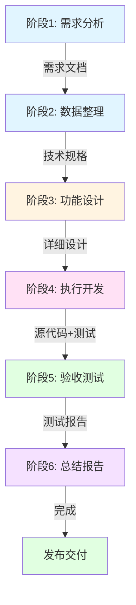

# Skill 开发工作流程 Meta-Skill

## 概述

这是 CIS 系统的**最优先 Meta-Skill**，定义了如何从需求到交付完成一个 Skill 的完整开发工作流程。

## 为什么需要这个 Meta-Skill?

1. **标准化流程** - 确保 Skill 开发有统一的质量标准
2. **提高效率** - 复用已验证的开发模式
3. **降低门槛** - 新开发者可以快速上手
4. **质量保证** - 每个阶段都有明确的验收标准

## 工作流程六阶段

### 阶段 1: 用户需求分析 (User Requirement Analysis)

**目标**: 理解用户真实需求，避免误解

**输入**:
- 用户的原始需求描述
- 相关背景文档
- 现有系统状态

**输出**:
- 需求分析报告 (`requirements/analysis.md`)
- 关键问题列表
- 需求优先级排序

**关键活动**:
```yaml
activities:
  - 与用户沟通，澄清模糊需求
  - 分析需求的可行性和风险
  - 识别技术约束和依赖
  - 确定需求优先级 (P0/P1/P2)

deliverables:
  - 需求分析文档
  - 问题清单 (FAQ)
  - 风险评估
```

**验收标准**:
- [ ] 用户确认需求理解正确
- [ ] 需求可量化、可验证
- [ ] 技术可行性已评估
- [ ] 优先级已明确

---

### 阶段 2: 需求数据整理与文档整合 (Data Organization & Documentation)

**目标**: 将需求结构化，整合到现有文档体系

**输入**:
- 阶段 1 的需求分析报告
- 现有架构文档
- 相关技术文档

**输出**:
- 结构化需求文档 (`requirements/spec.md`)
- 技术方案设计 (`design/technical-spec.md`)
- API/接口定义 (`design/api.md`)

**关键活动**:
```yaml
activities:
  - 提取关键需求点
  - 转化为技术规格
  - 设计数据结构和接口
  - 编写 API 文档

deliverables:
  - 需求规格说明
  - 技术设计文档
  - 接口定义 (OpenAPI/Protobuf)
  - 数据模型 (ER 图/Schema)
```

**验收标准**:
- [ ] 需求可追溯性 (ID 追溯)
- [ ] 技术方案评审通过
- [ ] 接口定义完整
- [ ] 数据模型设计合理

---

### 阶段 3: 基于需求与现状的功能设计 (Functional Design)

**目标**: 设计符合需求且可实施的功能

**输入**:
- 阶段 2 的技术规格
- 现有代码库状态
- 可用资源 (时间、人力)

**输出**:
- 详细设计文档 (`design/detailed-design.md`)
- 实现计划 (`implementation/plan.md`)
- 任务分解 (`implementation/tasks.md`)

**关键活动**:
```yaml
activities:
  - 架构设计 (模块划分)
  - 核心算法设计
  - 错误处理设计
  - 性能优化方案

deliverables:
  - 详细设计文档
  - 类图/时序图
  - 算法伪代码
  - 测试策略
```

**验收标准**:
- [ ] 设计符合需求规格
- [ ] 模块职责清晰
- [ ] 接口设计合理
- [ ] 可测试性良好

---

### 阶段 4: 执行开发 (Development)

**目标**: 编写高质量代码，实现设计功能

**输入**:
- 阶段 3 的详细设计
- 开发环境配置
- 依赖库

**输出**:
- 源代码 (`src/`)
- 单元测试 (`tests/`)
- 代码文档 (`docs/api.md`)

**关键活动**:
```yaml
activities:
  - 搭建开发环境
  - 编写核心功能代码
  - 编写单元测试
  - 代码审查 (Code Review)

best_practices:
  - TDD (测试驱动开发)
  - 持续集成 (CI)
  - 代码审查
  - 文档同步更新

deliverables:
  - 功能代码
  - 单元测试 (覆盖率 > 80%)
  - API 文档
  - 代码审查记录
```

**验收标准**:
- [ ] 所有单元测试通过
- [ ] 代码覆盖率 > 80%
- [ ] 代码审查通过
- [ ] 符合编码规范

---

### 阶段 5: 验收测试 (Acceptance Testing)

**目标**: 验证功能满足需求，质量达标

**输入**:
- 阶段 4 的代码
- 测试环境
- 验收测试用例

**输出**:
- 测试报告 (`testing/test-report.md`)
- Bug 清单 (`testing/bugs.md`)
- 性能基准 (`testing/benchmarks.md`)

**关键活动**:
```yaml
activities:
  - 集成测试
  - 系统测试
  - 性能测试
  - 安全测试
  - 用户验收测试 (UAT)

testing_types:
  functional:
    - 单元测试
    - 集成测试
    - 端到端测试

  non_functional:
    - 性能测试
    - 压力测试
    - 安全测试
    - 兼容性测试

deliverables:
  - 测试报告
  - Bug 清单及状态
  - 性能基准数据
  - 验收签字
```

**验收标准**:
- [ ] 所有 P0/P1 功能验收通过
- [ ] 无阻塞性 Bug
- [ ] 性能指标达标
- [ ] 用户签字确认

---

### 阶段 6: 总结报告 (Summary Report)

**目标**: 文档化整个开发过程，总结经验教训

**输入**:
- 前面各阶段的产出
- 用户反馈
- 项目数据

**输出**:
- 项目总结报告 (`docs/project-summary.md`)
- 用户手册 (`docs/user-guide.md`)
- 维护指南 (`docs/maintenance.md`)
- 经验教训 (`docs/lessons-learned.md`)

**关键活动**:
```yaml
activities:
  - 整理项目文档
  - 编写用户手册
  - 归档代码和文档
  - 总结经验教训
  - 制定后续改进计划

deliverables:
  - 项目总结报告
  - 用户手册
  - 开发者文档
  - 维护指南
  - 经验教训总结
```

**验收标准**:
- [ ] 文档完整
- [ ] 用户可自助使用
- [ ] 代码已归档
- [ ] 经验已沉淀

---

## 工作流程可视化



## 工作流程配置

每个 Skill 项目应该包含工作流配置文件 (`skill-workflow.yaml`):

```yaml
name: "示例 Skill"
version: "1.0.0"

workflow:
  stage_1_analysis:
    owner: "需求分析师"
    duration: "2-3天"
    artifacts:
      - "requirements/analysis.md"

  stage_2_documentation:
    owner: "技术文档工程师"
    duration: "1-2天"
    artifacts:
      - "requirements/spec.md"
      - "design/technical-spec.md"

  stage_3_design:
    owner: "架构师"
    duration: "2-4天"
    artifacts:
      - "design/detailed-design.md"
      - "implementation/plan.md"

  stage_4_development:
    owner: "开发工程师"
    duration: "5-10天"
    artifacts:
      - "src/"
      - "tests/"

  stage_5_testing:
    owner: "测试工程师"
    duration: "2-3天"
    artifacts:
      - "testing/test-report.md"

  stage_6_summary:
    owner: "技术文档工程师"
    duration: "1-2天"
    artifacts:
      - "docs/project-summary.md"
      - "docs/user-guide.md"

quality_gates:
  - stage: "stage_3_design"
    condition: "技术方案评审通过"
  - stage: "stage_4_development"
    condition: "代码覆盖率 > 80%"
  - stage: "stage_5_testing"
    condition: "无P0/P1 Bug"
```

## 实现优先级

### P0 (必须实现)
- [ ] 工作流程框架定义
- [ ] 每个阶段的产出模板
- [ ] 验收标准检查清单

### P1 (重要)
- [ ] 自动化工具支持
- [ ] 模板生成工具
- [ ] 进度跟踪功能

### P2 (可选)
- [ ] AI 辅助需求分析
- [ ] 自动化测试报告生成
- [ ] 项目度量仪表板

---

**文档版本**: v1.0
**最后更新**: 2026-02-02
**作者**: CIS Team
